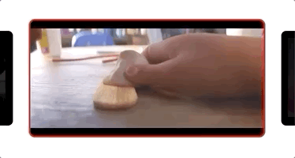
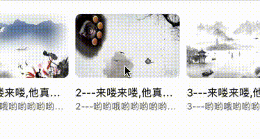
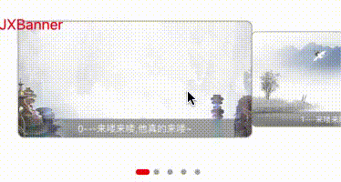
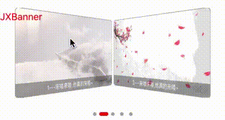
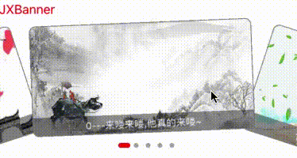

# JXBanner

[](https://travis-ci.org/Code_TanJX/JXBanner)
[](https://cocoapods.org/pods/JXBanner)
[](https://cocoapods.org/pods/JXBanner)
[](https://cocoapods.org/pods/JXBanner)


##### (JXBanner supports a variety of animation transformations, including pure code layout and Xib layout)

JXBanner relies on JXPageConytrol and includes many custom interfaces, such as transformation animation, view structure, and Settings

---

##### 

* Development environment: Xcode 7 
* Running condition: iOS(8.0+) 
* Open source framework ：[github地址](https://github.com/Coder-TanJX/JXBanner)
* [ Chinese is introduced [ 中文介绍 ]](https://blog.csdn.net/TanJiaXiang/article/details/98484390)

&nbsp;

（If there is any problem, you can leave a message, welcome to study together, welcome star ）

---

### Installation
To install, simply add the following code to your Podfile   : 

```ruby

platform :ios, '8.0'

target 'TargetName' do
pod 'JXBanner'
end

```

---


### The UI effect

* middleTarget

Add control proxy method to central Cell (when central Cell is shown/when leaving the center: developers can use custom actions, such as intermediate Cell, to play the video and stop it when leaving the center)



---

* scrollView

You need to set jxbannerparams-> isPagingEnabled(false) and isAutoPlay(false)



---

* default

You don't need to set JXBanner -> JXBannerLayoutParams


---

* JXBannerTransformLinear


--- 

* JXBannerTransformCoverflow


---

* custom

Need to implement JXBannerTransformable agreement, modify UICollectionViewLayoutAttributes - > the "transform3D" or "transform" properties


---

### Frame set 

&nbsp;

###### Banner 【Public class file of the graph framework in rotation】
* API  ---> All interfaces that developers can call
* Cell  ---> The framework provides cell base class (if you want to customize cell content, create a new cell that inherits from UICollectionViewCell)
* Common ---> Framework common class files
* Transform ---> Animation class files (if the framework provided by the animation effect can't meet the demand of the developer, can achieve new [JXBannerTransformable]() agreement struct/class , modified UICollectionViewLayoutAttributes - > the transform3D or transform properties)

###### PageControl -- Indicator class file
* JXBannerPageControlBuilder ---> Builder class for pageControl
* JXBannerPageControlDefault --->  Framework of the default pageControl style (can be implemented through JXBannerDataSource - > 【 jxBanner (pageControl banner: numberOfPages: coverView: builder:) - > JXBannerPageControlBuilder 】 protocol method modify the style)

---

### JXBanner : Introduction to important documents

&nbsp;

##### JXBannerParams 【Banner basic properties】

* isAutoPlay ---> Automatically play
* isBounces ---> Whether the boundary can slip beyond the boundary
* isShowPageControl ---> Whether internal load indicator  ( [JXPageControl（Framework features）](https://github.com/Coder-TanJX/JXPageControl)  ) 
* timeInterval ---> Play scheduling interval
* isPagingEnabled ---> Page scrolling mode
* contentInset ---> Set the padding
* cycleWay ---> [Loop mode（Framework features）]() （Forward: wireless right play, skipEnd: end-to-end custom animation jump, rollingBack: left-right rollback mode）
* edgeTransitionType ---> CycleWay uses skipEnd to choose how to animate
* edgeTransitionSubtype ---> CycleWay uses skipEnd to choose how to animate

---

##### JXBannerLayoutParams 【Banner layout, animation properties】

* itemSize ---> The cell size。
* itemSpacing ---> Cell margins left and right。
* layoutType ---> Animation effects[JXBannerTransformable（Framework features）]()
* minimumScale ---> Cell scaling factor。
* minimumAlpha ---> Cell transparency coefficient。
* maximumAngle ---> Cell rotation coefficient。
* rateOfChange ---> Cell variation coefficient。
* rateHorisonMargin ---> Cell horizontal spacing adjustment factor。

---

##### JXBannerCellRegister 【Cell registers builders】

* type ---> To register the cell type, you must be a subclass of UICollectionViewCell, When you are not using the nib cell file, you must set the  'type' to the cell class!!
* reuseIdentifier ---> Cell reuse identity. If you use multiple jxbanners in your app, please set different values to facilitate the differentiation
* nib ---> The nib parameter assignment must be done when using the nib cell file !!!

##### Pause or resume auto-scrolling
```swift
let banner = JXBanner(frame: .zero)

// Pause
banner.pauseAutoScrolling()

// Resume
banner.resumeAutoScrolling()
```


---
###  JXBanner use 

&nbsp;

##### Example 1

* Default implementation example

&nbsp;

```

import SnapKit
import JXBanner

class JXDefaultVC: UIViewController {

    var pageCount = 5

    lazy var banner: JXBanner = {
        let banner = JXBanner()
        banner.backgroundColor = UIColor.black
        banner.placeholderImgView.image = UIImage(named: "banner_placeholder")
        banner.delegate = self
        banner.dataSource = self
        return banner
    }()

    override func viewDidLoad() {
        super.viewDidLoad()
        view.addSubview(banner)
        banner.snp.makeConstraints { (maker) in
            maker.left.right.equalTo(view)
            maker.height.equalTo(250)
            maker.top.equalTo(view.snp_top).offset(100)
        }
        self.automaticallyAdjustsScrollViewInsets = false
    }

    deinit {
        print("\(#function) ----------> \(#file.components(separatedBy: "/").last?.components(separatedBy: ".").first ?? #file)")
    }
}

//MARK:- JXBannerDataSource
extension JXDefaultVC: JXBannerDataSource {

    // 注册重用Cell标识
    func jxBanner(_ banner: JXBannerType)
        -> (JXBannerCellRegister) {
            return JXBannerCellRegister(type: JXBannerCell.self,
            reuseIdentifier: "JXDefaultVCCell")
        }

    // 轮播总数
    func jxBanner(numberOfItems banner: JXBannerType)
        -> Int { return pageCount }

    // 轮播cell内容设置
    func jxBanner(_ banner: JXBannerType,
        cellForItemAt index: Int,
        cell: UICollectionViewCell)
        -> UICollectionViewCell {
            let tempCell: JXBannerCell = cell as! JXBannerCell
            tempCell.layer.cornerRadius = 8
            tempCell.layer.masksToBounds = true
            tempCell.imageView.image = UIImage(named: "banner_placeholder")
            tempCell.msgLabel.text = String(index) + "---来喽来喽,他真的来喽~"
            return tempCell
        }

    // banner基本设置（可选）
    func jxBanner(_ banner: JXBannerType,
        layoutParams: JXBannerLayoutParams)
        -> JXBannerLayoutParams {
            return layoutParams
            .itemSize(CGSize(width: UIScreen.main.bounds.width - 40, height: 200))
            .itemSpacing(20)
        }
}

//MARK:- JXBannerDelegate
extension JXDefaultVC: JXBannerDelegate {

    // 点击cell回调
    public func jxBanner(_ banner: JXBannerType,
    didSelectItemAt index: Int) {
    print(index)
    }

}


```

---

##### Example 2

&nbsp;

* personalization

```

import SnapKit
import JXBanner
import JXPageControl

class JXCustomVC: UIViewController {

    var pageCount = 5

    lazy var linearBanner: JXBanner = {[weak self] in
        let banner = JXBanner()
        banner.placeholderImgView.image = UIImage(named: "banner_placeholder")
        banner.backgroundColor = UIColor.black
        banner.indentify = "linearBanner"
        banner.delegate = self
        banner.dataSource = self    
        return banner
    }()

    lazy var converflowBanner: JXBanner = {
        let banner = JXBanner()
        banner.placeholderImgView.image = UIImage(named: "banner_placeholder")
        banner.backgroundColor = UIColor.black
        banner.indentify = "converflowBanner"
        banner.delegate = self
        banner.dataSource = self
        return banner
    }()

    override func viewDidLoad() {
        super.viewDidLoad()
        view.addSubview(linearBanner)
        view.addSubview(converflowBanner)
        linearBanner.snp.makeConstraints {(maker) in
            maker.left.right.equalTo(view)
            maker.height.equalTo(200)
            maker.top.equalTo(view.snp_top).offset(100)
        }

        converflowBanner.snp.makeConstraints {(maker) in
            maker.left.right.height.equalTo(linearBanner)
            maker.top.equalTo(linearBanner.snp_bottom).offset(100)
        }

        self.automaticallyAdjustsScrollViewInsets = false
    }

    deinit {
        print("\(#function) ----------> \(#file.components(separatedBy: "/").last?.components(separatedBy: ".").first ?? #file)")
    }
}

//MARK:- JXBannerDataSource
extension JXCustomVC: JXBannerDataSource {

    // 注册重用Cell标识
    func jxBanner(_ banner: JXBannerType)
        -> (JXBannerCellRegister) {

        if banner.indentify == "linearBanner" {
            return JXBannerCellRegister(type: JXBannerCell.self,
                reuseIdentifier: "LinearBannerCell")
        }else {
            return JXBannerCellRegister(type: JXBannerCell.self,
            reuseIdentifier: "ConverflowBannerCell")
        }
    }

    // 轮播总数
    func jxBanner(numberOfItems banner: JXBannerType)
        -> Int { return pageCount }

    // 轮播cell内容设置
    func jxBanner(_ banner: JXBannerType,
        cellForItemAt index: Int,
        cell: UICollectionViewCell)
        -> UICollectionViewCell {
            let tempCell: JXBannerCell = cell as! JXBannerCell
            tempCell.layer.cornerRadius = 8
            tempCell.layer.masksToBounds = true
            tempCell.imageView.image = UIImage(named: "banner_placeholder")
            tempCell.msgLabel.text = String(index) + "---来喽来喽,他真的来喽~"
            return tempCell
    }

    // banner基本设置（可选）
    func jxBanner(_ banner: JXBannerType,
        params: JXBannerParams)
        -> JXBannerParams {

        if banner.indentify == "linearBanner" {
            return params
                .timeInterval(2)
                .cycleWay(.forward)
        }else {
            return params
                .timeInterval(3)
                .cycleWay(.forward)
        }
    }

// banner布局、动画设置
    func jxBanner(_ banner: JXBannerType,   
        layoutParams: JXBannerLayoutParams)
        -> JXBannerLayoutParams {

        if banner.indentify == "linearBanner" {
            return layoutParams
                .layoutType(JXBannerTransformLinear())
                .itemSize(CGSize(width: 250, height: 190))
                .itemSpacing(10)
                .rateOfChange(0.8)
                .minimumScale(0.7)
                .rateHorisonMargin(0.5)
                .minimumAlpha(0.8)
        }else {
            return layoutParams
                .layoutType(JXBannerTransformCoverflow())
                .itemSize(CGSize(width: 300, height: 190))
                .itemSpacing(0)
                .maximumAngle(0.25)
                .rateHorisonMargin(0.3)
                .minimumAlpha(0.8)
        }
    }

    // 自定义pageControl样式、布局
    //（基于jxPageControl, 如果不适用JXPageControl, 设置isShowPageControl = false， 内部pageControl将不会再次加载 ） 
    func jxBanner(pageControl banner: JXBannerType,
        numberOfPages: Int,
        coverView: UIView,
        builder: JXBannerPageControlBuilder) -> JXBannerPageControlBuilder {

            if banner.indentify == "linearBanner" {
                let pageControl = JXPageControlScale()
                pageControl.contentMode = .bottom
                pageControl.activeSize = CGSize(width: 15, height: 6)
                pageControl.inactiveSize = CGSize(width: 6, height: 6)
                pageControl.activeColor = UIColor.red
                pageControl.inactiveColor = UIColor.lightGray
                pageControl.columnSpacing = 0
                pageControl.isAnimation = true
                builder.pageControl = pageControl
                builder.layout = {
                    pageControl.snp.makeConstraints { (maker) in
                        maker.left.right.equalTo(coverView)
                        maker.top.equalTo(coverView.snp_bottom).offset(10)
                        maker.height.equalTo(20)
                    }
                }
                return builder  

            }else {
                let pageControl = JXPageControlExchange()
                pageControl.contentMode = .bottom
                pageControl.activeSize = CGSize(width: 15, height: 6)
                pageControl.inactiveSize = CGSize(width: 6, height: 6)
                pageControl.activeColor = UIColor.red
                pageControl.inactiveColor = UIColor.lightGray
                pageControl.columnSpacing = 0
                builder.pageControl = pageControl
                builder.layout = {
                    pageControl.snp.makeConstraints { (maker) in
                        maker.left.right.equalTo(coverView)
                        maker.top.equalTo(coverView.snp_bottom).offset(10)
                        maker.height.equalTo(20)
                    }
                }
                return builder
        }

    }

}

//MARK:- JXBannerDelegate
extension JXCustomVC: JXBannerDelegate {

    // 点击cell回调
    public func jxBanner(_ banner: JXBannerType,
        didSelectItemAt index: Int) {
        print(index)
    }

    // 设置自定义覆盖View, 比如添加自定义外部pageControl和布局
    func jxBanner(_ banner: JXBannerType, coverView: UIView) {
        let title = UILabel()
        title.frame = CGRect(x: 0, y: 0, width: 100, height: 30)
        title.text = "JXBanner"
        title.textColor = UIColor.red
        title.font = UIFont.systemFont(ofSize: 16)
        coverView.addSubview(title)
    }

    // 最中心显示cell 索引
    func jxBanner(_ banner: JXBannerType, center index: Int) {
        print(index)
    }
}

```

##### Example 3 

If the animation provided by the framework does not meet the developer's requirements：

* 1.Rotation diagram animation style developers can customize the implementation, As long as it is a new implementation [JXBannerTransformable]() agreement struct/class, modify UICollectionViewLayoutAttributes - > the transform3D or transform properties

```

//
//  JXCustomTransform.swift
//  JXBanner_Example
//
//  Created by Coder_TanJX on 2019/7/30.
//  Copyright © 2019 CocoaPods. All rights reserved.
//

import UIKit
import JXBanner

struct JXCustomTransform: JXBannerTransformable {

    public func transformToAttributes(collectionView: UICollectionView,
        params: JXBannerLayoutParams,
        attributes: UICollectionViewLayoutAttributes) {

        let collectionViewWidth = collectionView.frame.width
        if collectionViewWidth <= 0 { return }

        let centetX = collectionView.contentOffset.x + collectionViewWidth * 0.5;
        let delta = abs(attributes.center.x - centetX)
        let calculateRate = 1 - delta / collectionViewWidth
        let angle = min(delta / collectionViewWidth * (1 - params.rateOfChange), params.maximumAngle)
        let alpha = max(calculateRate, params.minimumAlpha)


        applyCoverflowTransformToAttributes(viewCentetX: centetX,
            attributes: attributes,
            params: params,
            angle: angle,
            alpha: alpha,
            calculateRate: calculateRate)
    }

    func applyCoverflowTransformToAttributes(viewCentetX: CGFloat,
        attributes: UICollectionViewLayoutAttributes,
        params: JXBannerLayoutParams,
        angle: CGFloat,
        alpha: CGFloat,
        calculateRate: CGFloat) -> Void {
        var transform3D: CATransform3D = CATransform3DIdentity


        let location = JXBannerTransfrom.itemLocation(viewCentetX: viewCentetX,
        itemCenterX: attributes.center.x)

        var _angle = angle
        var _alpha = alpha
        var _translateX: CGFloat = 0
        var _translateY: CGFloat = 0
        attributes.zIndex = 0

        switch location {
        case .left:
            _angle = angle
            _translateX = 0.2 * attributes.size.width * (1 - calculateRate) / 4
            _translateY = 0.4 * attributes.size.height * (1 - calculateRate)


        case .right:
            _angle = -angle
            _translateX = -0.2 * attributes.size.width * (1 - calculateRate) / 4
            _translateY = 0.4 * attributes.size.height * (1 - calculateRate)

        case .center:
            _angle = 0
            _alpha = 1
            _translateY = 0
            attributes.zIndex = 10000
        }

        transform3D = CATransform3DTranslate(transform3D, _translateX, _translateY, 0)
        transform3D = CATransform3DRotate(transform3D, -CGFloat.pi * _angle, 0, 0, 1)
        attributes.alpha = _alpha
        attributes.transform3D = transform3D
    }

}


```

* 2. Set up custom implementation animation

JXBannerDataSource -> 【jxBanner(_ banner: layoutParams: ) -> JXBannerLayoutParams】

```

// JXCustomTransform()

    func jxBanner(_ banner: JXBannerType,
        layoutParams: JXBannerLayoutParams)
        -> JXBannerLayoutParams {

        return layoutParams
            .layoutType(JXCustomTransform())
    }

```

### See examples for more Settings [Demo address](https://github.com/Code-TanJX/JXPageControl)


## Author

Coder_TanJX, code_tanjx@163.com

## License

JXBanner is available under the MIT license. See the LICENSE file for more info.
